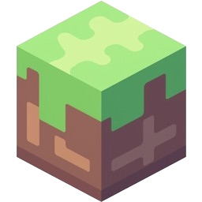

# MineScape

Pioneering a Truly User-Owned and Community-Driven Sandbox World-Building Experience

## Overview

MineScape is a decentralized sandbox protocol inspired by Minecraft, built on Filecoin's decentralized storage network. It empowers users to collaboratively create, own, and monetize virtual worlds. By anchoring all resources to real-world storage, MineScape prevents artificial inflation and fosters authenticity. The protocol introduces a novel asset class—blocks and composable items with inheritable attributes—driving an on-chain economy where builders, creators, and miners collaborate.

## Roadmap
- To be rolled out in upcoming phases. Check the [whitepaper](https://raw.githubusercontent.com/Ancients-Research/MineScape/refs/heads/main/MineScape%20Whitepaper%20Latest.pdf" download="MineScape-Whitepaper.pdf) for details.

## Contributing
We welcome contributions from builders, creators, and miners! 
- Submit issues or PRs for features, bug fixes, or documentation.
- Join community discussions on our [Discord](https://discord.gg/wU4JKPRJ).

## References
- [Whitepaper](https://raw.githubusercontent.com/Ancients-Research/MineScape/refs/heads/main/MineScape%20Whitepaper%20Latest.pdf" download="MineScape-Whitepaper.pdf)
- [Ancients Research](https://ancientsresearch.xyz)
- [Filecoin Documentation](https://docs.filecoin.io)

For questions, contact: cs@guazi.io